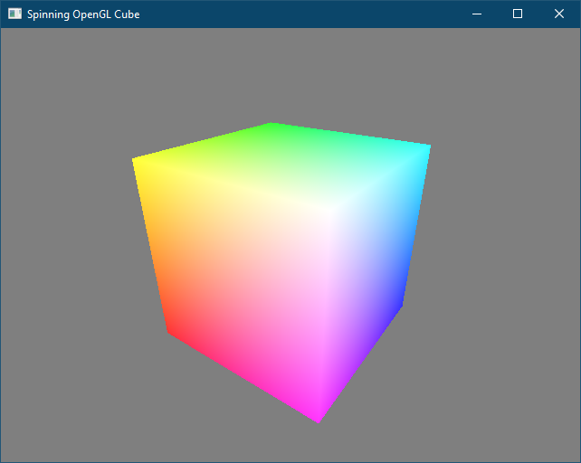
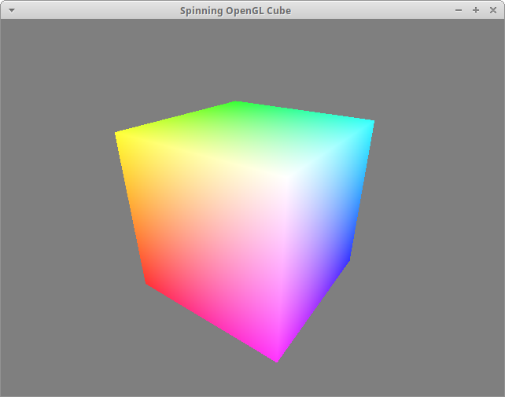

# spinning_cube

Basic cross-platform SDL and OpenGL demo!

Windows  

Linux  

## Setup

1. Download and install SDL as [documented here](../sdl_bindings/README.md).
2. On Windows: copy `SDL2.dll` to the current directory; this DLL is needed when running the program.

## Build

* On Windows: `mu --args spinning_cube_windows.args && cl /I"../sdl_bindings/SDL2/include" spinning_cube.c /link kernel32.lib user32.lib ../sdl_bindings/SDL2/lib/x64/SDL2.lib opengl32.lib`
* On Linux: `mu --args spinning_cube_linux.args && gcc -I../sdl_bindings/SDL2/include -L../sdl_bindings/SDL2/build/build/.libs -o spinning_cube spinning_cube.c -lm -lSDL2 -lGL -lGLU`

## Run

* On Windows: `spinning_cube`
* On Linux: `./spinning_cube`
